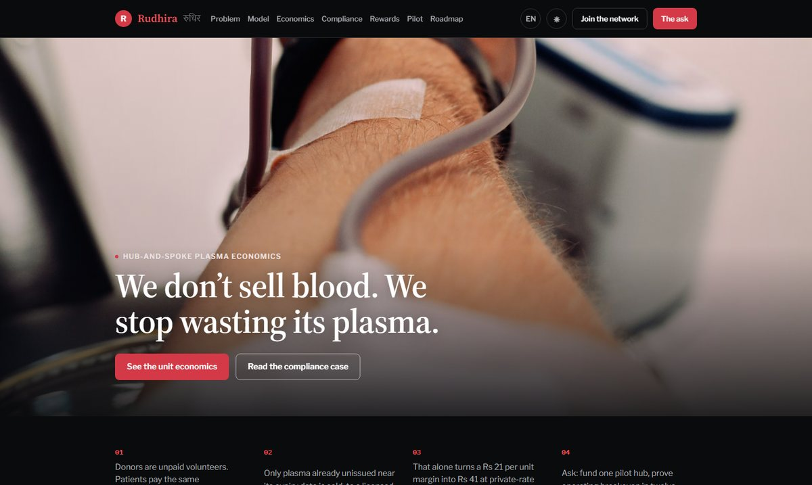
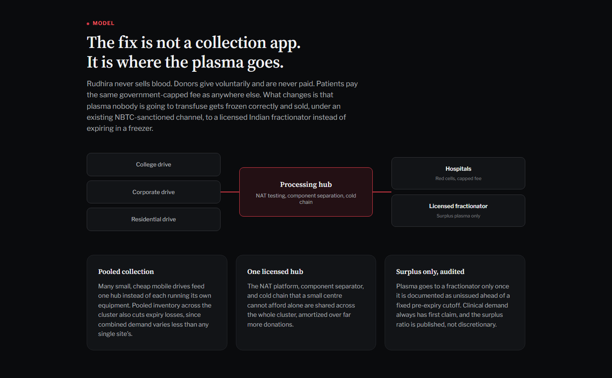
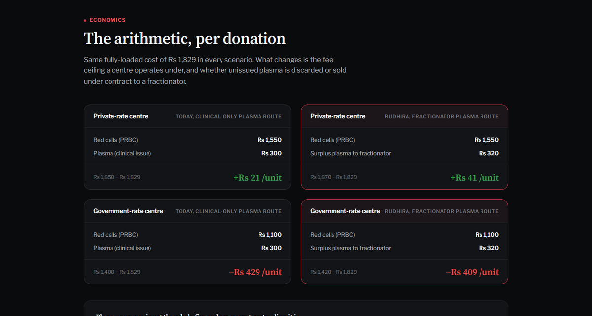
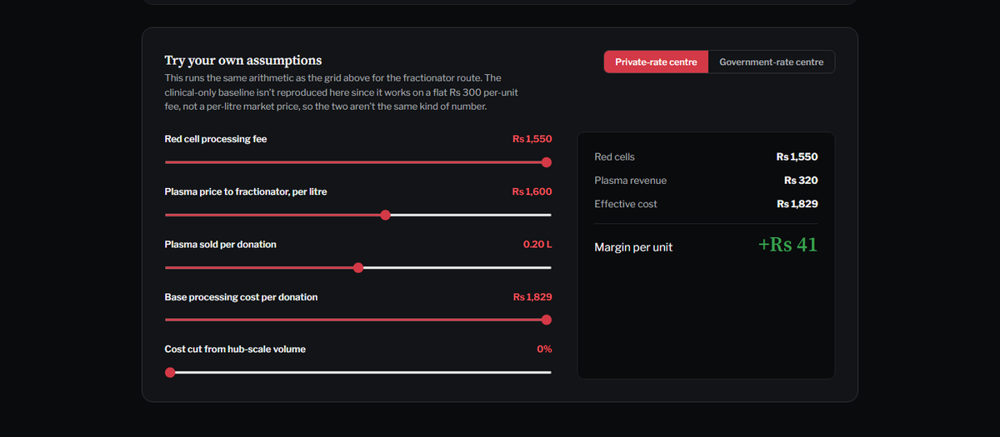
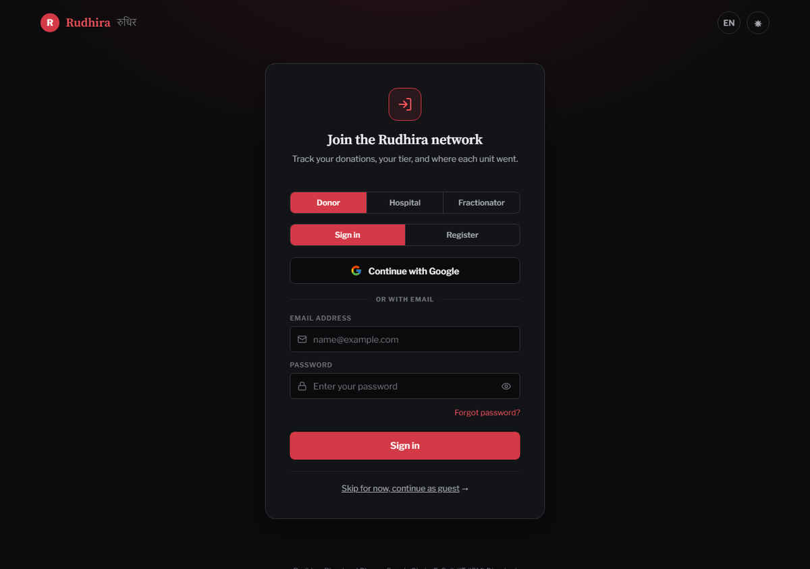
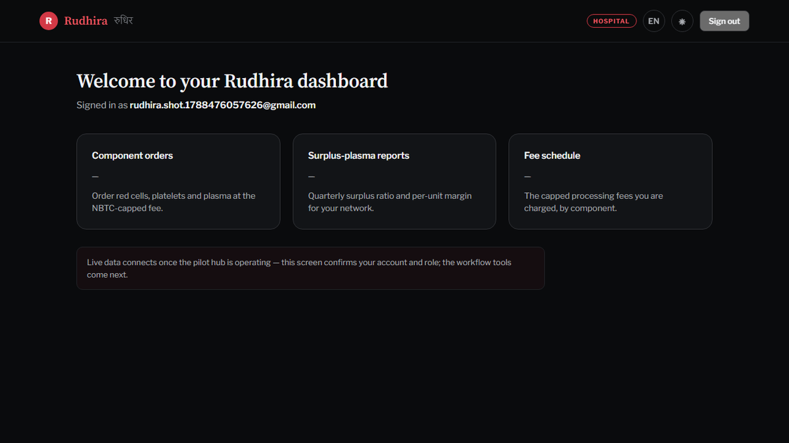
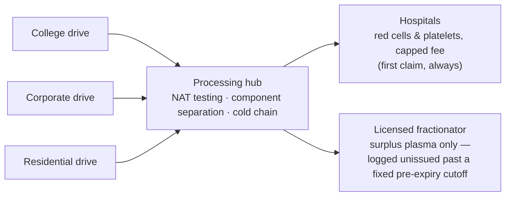
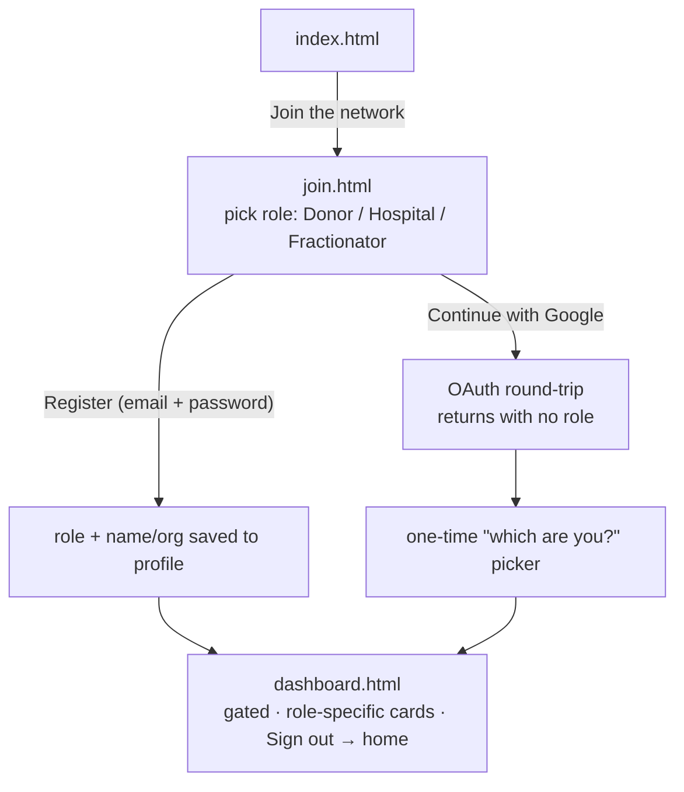

# Rudhira

**A self-sustaining blood and plasma supply model — and a working prototype of the network it needs.**

🔗 **Live:** https://sih-internal-proj.vercel.app

> _We don't sell blood. We stop wasting its plasma._



---

## The idea

India's blood banks aren't badly run — they're **badly funded, by design.**

- The processing fee a blood centre may charge is capped by the National Blood Transfusion Council. That ceiling is the ethical floor of the whole system and shouldn't move — but it also means a centre **cannot price its way out of a cost problem.**
- A whole-blood donation splits into three products. **Plasma is the anomaly:** it freezes for ~a year, is produced automatically on every donation, and hospitals need far less of it than gets collected. It is the single largest category of blood-product waste in the country — **~3,00,000+ units discarded in a single reported year.**
- Meanwhile a licensed Indian fractionator has paid **~₹1,600 per litre** for surplus plasma (AIIMS Nagpur, RTI-disclosed).

**Rudhira's model:** a hub-and-spoke network. Many small, cheap mobile collection drives feed **one licensed processing hub** (NAT testing, component separation, cold chain). The hub sends red cells to hospitals at the capped fee, and sells **only plasma documented as unissued ahead of a fixed pre-expiry cutoff** to a licensed fractionator — a channel NBTC guidelines already permit. That revenue covers the hub's operating cost, so the patient's fee doesn't have to.

Blood is never sold. Donors are unpaid volunteers. Clinical demand always has first claim, and the surplus ratio is capped, audited, and published.

**The ask:** fund one pilot hub, prove operating breakeven in twelve months, then replicate.

---

## What's in this repo

Two deliverables in one static site:

### 1. The pitch site — `index.html`
A ten-section explainer: the problem, the model, the per-donation **unit economics with an interactive calculator**, the compliance case, the donor rewards programme, pilot-city analysis, a month-by-month roadmap, risks, and the ask. Fully **bilingual (English / Hindi)**, dark/light themes, editorial design.

### 2. The network prototype — `join.html` + `dashboard.html`
Real sign-up / sign-in for the three parties the model connects — **Donor, Hospital, Fractionator** — each landing on a role-specific dashboard. Backed by Supabase (email + password **and** Google sign-in).

---

## Screenshots

**The model — hub-and-spoke plasma flow**


**Unit economics — the arithmetic, per donation**


**Interactive calculator — try your own assumptions**


**Join the network — three roles, email or Google**


**Role dashboard — gated, role-specific**


---

## Workflow

### A · The Rudhira model (real-world flow)



1. A donor gives at a mobile drive — voluntary, unpaid.
2. The hub screens (NAT), separates components, freezes plasma.
3. Red cells and platelets go to hospitals at the NBTC-capped fee. **Clinical demand has first claim, always.**
4. Plasma still unissued at a fixed pre-expiry cutoff is logged as surplus and shipped to a licensed fractionator for revenue.
5. The surplus ratio is capped, audited, and published quarterly.

### B · The app (network sign-in flow)



- **Register** with email + password → role (Donor / Hospital / Fractionator) and name/organisation are saved to the user's profile → straight to the dashboard.
- **Google sign-in** → OAuth round-trip → returns with no role → a one-time _"which are you?"_ picker → dashboard.
- **Dashboard** shows a role-specific card grid (donor: donations · tier · impact / hospital: component orders · surplus-plasma reports · fee schedule / fractionator: offtake agreements · documented-surplus shipments).
- Session persists across pages; the homepage button becomes **"Dashboard"** while signed in; **Sign out** returns to the homepage.
- Dashboard data is placeholder — this is the **account + role layer**; the operational tools come next.

---

## Tech / tools

| Area | Choice |
|---|---|
| Front end | Vanilla **HTML + CSS + JavaScript** — no framework, no build step |
| Type | Source Serif 4, Libre Franklin, IBM Plex Mono (Google Fonts) |
| i18n | Hand-rolled dictionary (`translations.js`, ~280 keys) + `data-i18n` attributes, EN / HI |
| Auth + backend | **Supabase** (GoTrue) — email/password + Google OAuth, roles stored in user metadata |
| Client library | `@supabase/supabase-js` v2 (CDN, UMD build) |
| Hosting | **Vercel** — static, auto-deploys on push to `main` |
| Version control | GitHub — `SoAkeD1/SIH_INTERNAL_proj` |
| Design origin | Initial layout drafted in **Claude Design**, then hand-finished |

---

## Project structure

```
index.html          Pitch site — 10 sections
styles.css          Design tokens + all page styles
script.js           Theme/lang toggles, live wastage counter, unit-economics
                    calculator, scroll reveals, auth-aware nav swap
translations.js     EN / HI dictionary (~280 keys)
join.html           Sign-in / registration — 3 roles, email+password + Google
dashboard.html      Gated role dashboard + first-time role picker
config.js           Supabase project URL + publishable key (public, safe to commit)
og-image.png        1200×630 social share card
docs/img/           Screenshots used in this README
```

---

## Run locally

```bash
python -m http.server 8000
# open http://localhost:8000
```

No build step. `config.js` already points at the shared Supabase project, so **email + password auth works locally**. Google sign-in only works from the deployed origin (localhost isn't in Supabase's redirect allow-list).

---

## Deploy

Every push to `main` auto-deploys to Vercel — framework preset **Other**, no build command, output = repo root.

---

## Auth setup (already configured — for reference)

- Supabase project `eixyqpfhtaoyblwjfehu`, region `ap-south-1` (Mumbai)
- Email confirmations **off** → demo signups are instant, no inbox needed
- Google provider enabled with an OAuth client in Google Cloud project `rudhira`; redirect URI `https://eixyqpfhtaoyblwjfehu.supabase.co/auth/v1/callback`
- Site URL + redirect allow-list point at `https://sih-internal-proj.vercel.app`

---

## Known limits (hackathon scope)

- **Dashboard cards are placeholders** — the account + role layer is real; operational data (donations, orders, shipments) isn't wired yet.
- **Google sign-in is limited to test-user emails** — the Google app is in "Testing" mode; publishing needs a hosted privacy-policy URL.
- **No email verification** — confirmations are off for demo speed.

---

## Team

**Team Rudhira** — Blood and Plasma Supply Chain · Entrepreneurship Cell, IIT (ISM) Dhanbad
